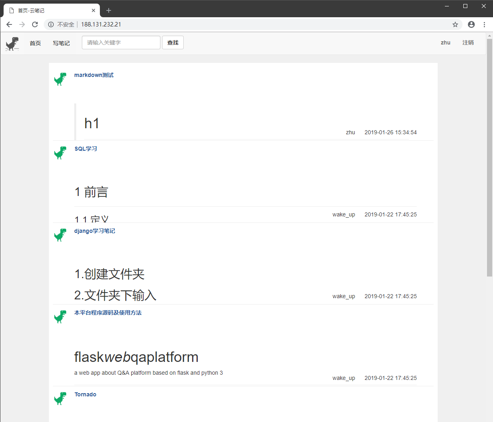
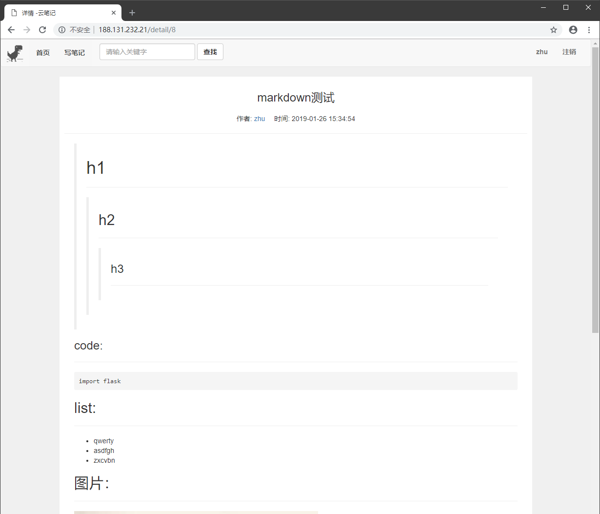
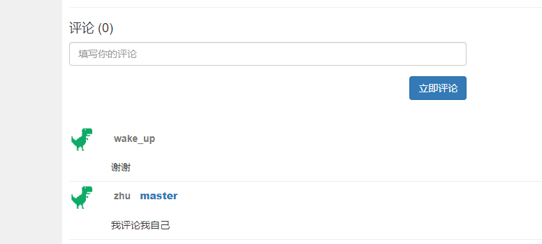

# flask_web_qaplatform
基于flask及python3的十分简陋的“云笔记”平台

### [程序源代码](https://github.com/wake-up-smiling/flask_web_qaplatform)

https://github.com/wake-up-smiling/flask_web_qaplatform

## [点击跳转](http://188.131.232.21) 

地址：188.131.232.21:80

##注意：
注册时不要使用自己正在用的任何密码，我在后台能看到


https://github.com/wake-up-smiling/flask_web_qaplatform

## 要求:

### 1.包:
1. flask 1.0.2
2. flask-sqlalchemy
3. flask-migrate
4. flask-script
### 2.软件:
1. python 3.7
2. mysql


## 如何使用:
### 1. mysql
```
>>mysql -uroot -p
>>password:
>>create database wake_up;
>>exit;
```

### 2. start-up app
```
>>python manage.py db init
>>python manage.py db migrate
>>python manage.py db upgrade
>>python wake_up.py
```

> ## 效果图
### 主页
 
>

### 详情页

>

### 评论功能

>

# The-end


